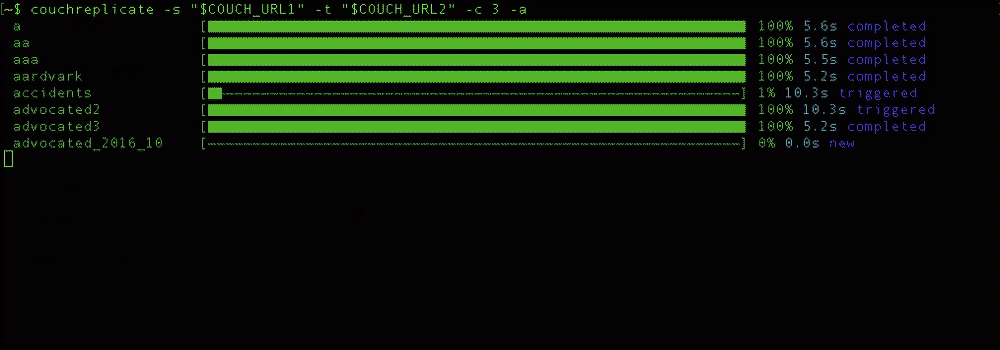

# couchreplicate

[](https://travis-ci.org/ibm-watson-data-lab/couchreplicate) [](https://badge.fury.io/js/couchreplicate)

This is a command-line tool and library that helps coordinate [Apache CouchDB](http://couchdb.apache.org/)™ or [IBM Cloudant](https://www.ibm.com/cloud/cloudant) replications. It can be used to replicate a single database, multiple databases or an entire cluster from a source instance to a target instance.

It is written in Node.js and can be installed from `npm` or used programmatically in your own Node.js projects.



## Pre-requisites

- [Node.js & npm](https://nodejs.org/en/)
- one or more source databases in an Apache CouchDB or IBM Cloudant instance
- a target Apache CouchDB or IBM Cloudant instance

## Installation

Install with npm

    npm install -g couchreplicate

Supplying `-g` instructs npm to install the library globally. You can find out where global npm modules are installed by running `npm config list`. You can find out which user is used to install global modules by running `npm -g config get user`. I had to repair the permissions of pre-existing libraries by running `chown -R nobody /usr/local/lib/node_modules/*`. 

## Usage

### Replicating all databases from one instance to another

    couchreplicate -a -s http://u:p@localhost:5984 -t https://U:P@HOST.cloudant.com

or 

    couchreplicate --all --source http://u:p@localhost:5984 --target https://U:P@HOST.cloudant.com

where `http://u:p@localhost:5984` is the URL of your source instance and `https://U:P@HOST.cloudant.com` is the URL of your target instance. They must include `admin` credentials.

### Replicating a list of databases

    couchreplicate -d db1,db2,db3 -s http://u:p@localhost:5984 -t https://U:P@HOST.cloudant.com

where `db1,db2,db3` is a comma-separated list of database names.

### Replicating a single database

    couchreplicate -d mydb -s http://u:p@localhost:5984 -t https://U:P@HOST.cloudant.com

or 

    couchreplicate -s http://u:p@localhost:5984/mydb -t https://U:P@HOST.cloudant.com/mydb

where `mydb` is the name of the database. When supplying the source and target database names in the URL, the database names need not match.

### Additionally replicating the _security document

Normal CouchDB replication leaves the `_security` document behind. The `_security` document is used to determine which users have which levels of access to the database. Without a `_security` document specified, only an `_admin` user can read/write/update/delete documents.

If you pass the `--auth` or `-x` command-line parameter, then *couchreplicate* will copy the `_security` document from the source to the target database at the end of the replication process e.g:

    couchreplicate -s http://u:p@localhost:5984/mydb -t https://U:P@HOST.cloudant.com/mydb --auth

### Errors during replication

Replication errors can occur and have a multitude of causes. If a replication does not complete successfully, you may see a status like this:

```sh
 cities [▇▇▇▇▇▇▇▇▇▇▇▇▇▇▇▇▇▇▇▇▇▇▇▇▇▇▇▇▇▇▇▇▇▇▇▇▇▇▇▇▇▇▇▇▇▇▇▇▇▇▇▇▇▇▇▇▇▇——] 97% 21.1s error
 ```

 - the document count may not reach 100%
 - the status string at right-hand side will read 'error'

 It may be caused by:

 - incorrect authentication credentials at the source or target side
 - insufficient privileges - make sure you have "admin" credentials for the source and target clusters
 - the target service may have a size restriction on documents. The Cloudant "Lite" plan has a limit of 1MB per API request, so very large JSON documents would not make it
 - the target service may have a API rate limit in place. If the target is very busy, then there may be insufficient capacity left over to service the replication process

## Command-line parameters

- `--source` / `-s` - source URL (required)
- `--target` / `-t` - target URL (required)
- `--databases` / `-d` - comma-separated list of database names
- `--all` / `-a` - replicate all databases
- `--concurrency` / `-c` - the number of replications to run at once (default = 1)
- `--auth` / `-x` - also copy the `_security` document during replication
- `--quiet` / `-q` - suppress progress bars
- `--help` / `-h` - show help message
- `--version` / `-v` - show version number

## Using couchreplicate programmatically

Install the library into your own Node.js project

    npm install --save couchreplicate

Load the module into your code

```js
  const cm = require('couchmigrate')
```

Set off a single replication:

```js
  const srcURL = "http://u:p@localhost:5984/sourcedb"
  const targetURL = "https://U:P@HOST.cloudant.com/targetdb"
  const showProgressBar = false
  const copyAuth = false
  
  cm.migrateDB(srcURL, targetURL, showProgressBar, copyAuth).then(() => {
    console.log('done')
  })
```

multiple replications:

```js
  const srcURL = "http://u:p@localhost:5984"
  const targetURL = "https://U:P@HOST.cloudant.com"
  const showProgressBar = false
  const databases = ['animals', 'minerals', 'vegetables']
  const concurrency = 3
  const copyAuth = false
  
  cm.migrateList(srcURL, targetURL, showProgressBar, databases, concurrency, copyAuth).then(() => {
    console.log('done')
  })
```

or replicate an entire cluster:

```js
  const srcURL = "http://u:p@localhost:5984"
  const targetURL = "https://U:P@HOST.cloudant.com"
  const showProgressBar = false
  const databases = ['animals', 'minerals', 'vegetables']
  const concurrency = 3
  const copyAuth = false
  
  cam.migrateAll(srcURL, targetURL, showProgressBar, concurrency, copyAuth).then(() => {
    console.log('done')
  })
```